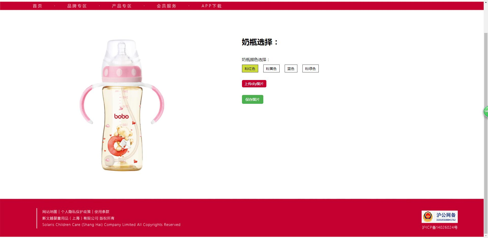
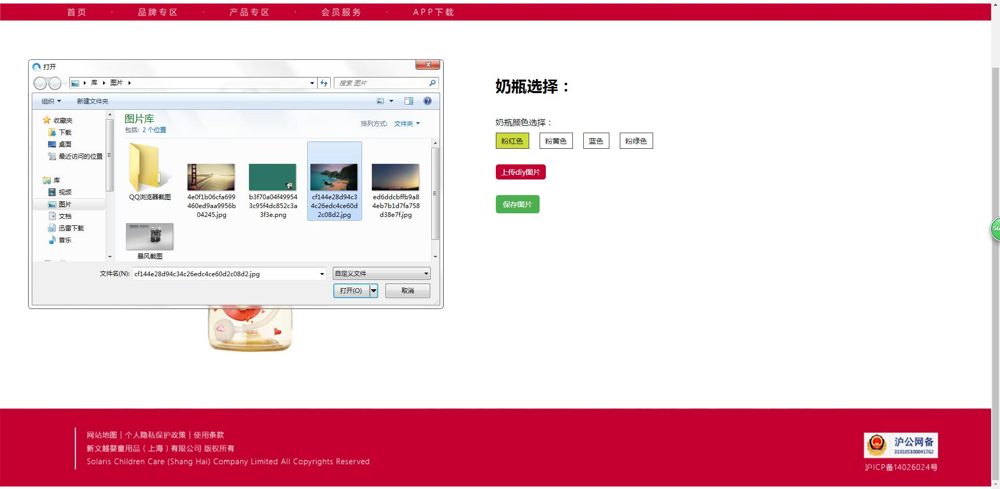
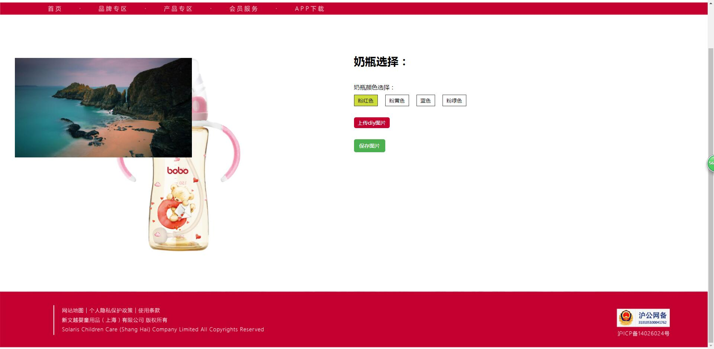
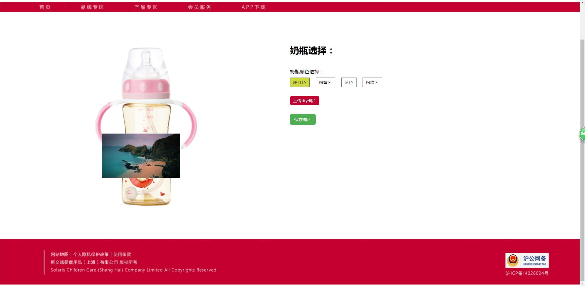

# 奶瓶diy
 
[项目地址演示](https://luoanyang.github.io/vueProductDiy/index.html)  

1. 参考了[慕课网的js鼠标拖拽效果教程](http://www.imooc.com/learn/60)使用vue.js实现拖拽
2. 根据拖拽功能写的缩放功能
3. 上传图片预览
4. 对vue.js里面methods的方法中的参数e的使用中发现的一些问题，html页面中写@click='fun'，methods中的fun(e)中的参数e才有数据。而html页面中写@click='fun()'，methods中的fun(e)中的参数e没有数据。而html页面中写@click='fun($event)'，methods中的fun(e)中的输出参数e又有数据。所以html中要用e参数是最好写成@click='fun($event)'或者@click='fun'
5. jquery和html2canvas.js实现了截图下载图片。

